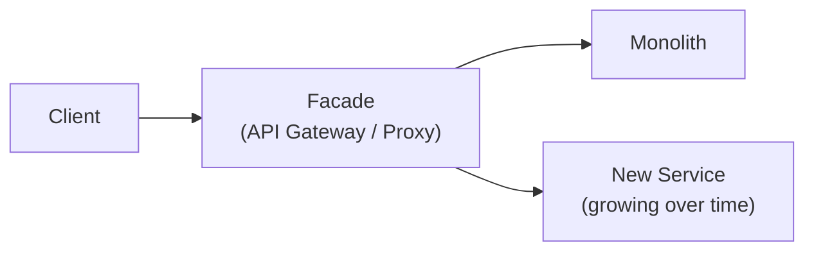
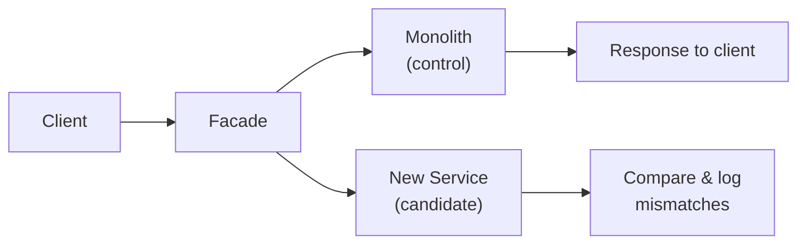
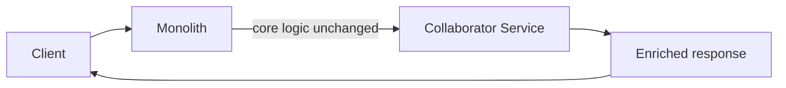
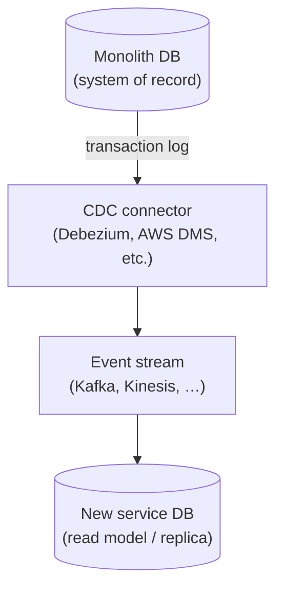
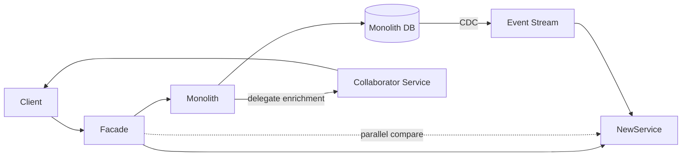

# Motivation

Rewriting a monolith in one go is risky. Production traffic, shared databases, and years of implicit business rules make a big-bang replacement hard to plan and harder to roll back.

Incremental migration patterns let you extract capability piece by piece while the existing system keeps running. This post covers four patterns that work well together:

1. **Strangler Fig** — the overall routing and replacement strategy
2. **Parallel Run** — verification without user-facing risk
3. **Collaborator** — extending the monolith before you replace it
4. **Change Data Capture (CDC)** — keeping data in sync during the transition

None of these patterns replaces the others. A typical migration orchestrates all four at different stages.

## Strangler Fig Pattern

The **Strangler Fig** pattern is named after a tree that grows around its host until the host dies. You apply the same idea to software: build new services around the monolith and gradually shift traffic away until the monolith can be decommissioned.

### How It Works

A **facade** (API gateway, reverse proxy, or routing layer) sits between clients and the backend. Initially, all traffic goes to the monolith. As each slice of functionality is rebuilt in a new service, the facade updates its routing rules to send that slice to the new service instead.

Over time, the facade routes more and more requests to new services. When no traffic remains on the monolith, you retire it.

### Typical Steps

1. Deploy a routing layer in front of the monolith (100% traffic to legacy).
2. Pick a bounded, low-risk capability to extract first (e.g. notifications, reporting, a read-only API).
3. Build that capability as a new service.
4. Update the facade to route matching requests to the new service.
5. Monitor, validate, and repeat for the next capability.
6. Decommission the monolith when it handles no production traffic.

### Why Use It

- **Incremental risk** — each step is small and reversible.
- **Continuous delivery** — users keep getting value while migration proceeds.
- **Clear rollback** — point the facade back at the monolith for a given route.

### Good First Candidates

Start with capabilities that are:

- **Self-contained** — few cross-domain dependencies
- **Read-heavy** — easier to sync data and validate
- **Low business risk** — a bad rollout does not block checkout or payments

## Parallel Run Pattern

**Parallel Run** is a verification technique used *inside* a strangler migration. Both the legacy system and the new service process the same request (or a copy of it). You compare the outcomes, but only the legacy result is returned to the user.

This gives you production confidence before you cut traffic over.

### How It Works

The facade (or an in-process wrapper) sends traffic to both paths. A comparison layer records:

- Response body differences
- Status code mismatches
- Latency deltas
- Side effects (e.g. duplicate writes — usually avoided by making the candidate read-only at first)

Tools like GitHub's **Scientist** library formalise this: run control and candidate in random order, compare, always return the control result.

### When to Use It

Parallel run is worth the extra cost when correctness is critical:

- Pricing and billing
- Permissions and authorisation
- Fraud detection
- Inventory or stock calculations

For low-risk read paths, shadow traffic and spot checks may be enough.

### Completion Criteria

Cut over to the new service when:

- Mismatch rate is at or near zero for a sustained period
- Edge cases found in comparison have been fixed
- Operational metrics (latency, error rate) are acceptable

## Collaborator Pattern

The **Collaborator** pattern extends the monolith without modifying its core logic. Instead of replacing a module inside the monolith, you attach a microservice that **decorates** or **enriches** the monolith's behaviour.

The monolith still owns the original request and response. The collaborator adds new capability around it.

### How It Works

A common flow:

1. The monolith handles the request as it always has.
2. Before or after the core handler, the monolith (or facade) calls a collaborator service.
3. The collaborator adds data (recommendations, personalisation, audit logging) or applies a cross-cutting concern (rate limiting, feature flags).
4. The combined result is returned to the client.

### Why Use It

- **No immediate surgery** — you avoid risky changes deep inside legacy code.
- **Proves the boundary** — you learn the integration contract before full extraction.
- **Delivers new features faster** — greenfield logic lives in a new service from day one.

### Migration Path

Collaborator is often a stepping stone to strangler:

1. **Collaborate** — monolith calls out to a service for new behaviour.
2. **Extract reads** — route read traffic for that domain to the new service.
3. **Extract writes** — shift writes once data sync and parallel run give confidence.
4. **Decommission** — remove the in-monolith code path.

## Change Data Capture (CDC)

Splitting a monolith usually means splitting its database too. **Change Data Capture** streams inserts, updates, and deletes from the monolith's database to one or more downstream services — without dual writes from application code.

### How It Works

CDC tools read the database **transaction log** (WAL, binlog, redo log), not application queries. That means every change is captured, including batch jobs, admin scripts, and other writers that bypass the app layer.

### Typical Phases

1. **Bulk load** — copy historical data into the new service's store (ETL or snapshot).
2. **Continuous sync** — CDC keeps the new store caught up while the monolith remains authoritative.
3. **Read cutover** — route reads to the new service once lag and consistency checks pass.
4. **Write cutover** — new service becomes system of record; CDC direction may reverse for a safety window.
5. **Cleanup** — retire the old tables or schema once the migration is stable.

### Why Prefer CDC Over Dual Write

Dual write (application writes to two databases) fails under partial outages: one write succeeds, the other fails, and reconciliation becomes your full-time job. CDC keeps a **single writer** (the monolith) until you are ready to flip authority.

### Tools

- **Debezium** — open source, Kafka Connect–based, supports PostgreSQL, MySQL, SQL Server, MongoDB, and more
- **AWS DMS** — managed migration and ongoing replication
- **Database-native** — SQL Server CDC, Oracle GoldenGate, logical replication in PostgreSQL

## How the Patterns Work Together

These patterns address different problems. A realistic migration combines them:

| Phase | Pattern | Purpose |
|-------|---------|---------|
| Plan routing | Strangler Fig | Facade in place; decide extraction order |
| Add features safely | Collaborator | New behaviour in a service without rewriting core |
| Keep data aligned | CDC | Stream changes to the new service's data store |
| Build confidence | Parallel Run | Compare legacy vs new on real traffic |
| Cut over | Strangler Fig | Shift routing; retire monolith slice |

### Example: Extracting a Notifications Service

1. **Strangler** — deploy an API gateway; all `/notifications` traffic still hits the monolith.
2. **Collaborator** — monolith calls a new notifications service to send emails while still owning the `notifications` table.
3. **CDC** — Debezium tails the monolith PostgreSQL WAL; the new service builds its own read model from Kafka events.
4. **Parallel Run** — gateway sends a copy of each notification request to the new service; compare sent payloads and delivery status; return monolith result.
5. **Cutover** — route `/notifications` to the new service; monolith stops writing notification rows; CDC stops or reverses after a safety period.

## Choosing and Combining Patterns

| Pattern | Best for | Avoid when |
|---------|----------|------------|
| Strangler Fig | Any incremental migration | You truly need a clean-slate rewrite with no legacy users |
| Parallel Run | High-stakes correctness paths | Cost/latency of double execution is prohibitive |
| Collaborator | Adding features or proving a boundary | The domain is so tangled that decoration adds more coupling |
| CDC | Database decomposition, read replicas | Source DB has no reliable transaction log or CDC support |

## Summary

Migrating from a monolith to services is less about picking one pattern and more about **orchestrating** several:

- **Strangler Fig** provides the migration spine — route traffic incrementally through a facade.
- **Parallel Run** reduces cutover risk — prove the new system on production traffic before users depend on it.
- **Collaborator** lets you extend without rewriting — attach services before you extract.
- **CDC** keeps data honest — one writer, streamed changes, no fragile dual writes.

Start with a thin facade, one bounded context, CDC for data sync, and parallel run for anything you cannot afford to get wrong. Add complexity only when a step is proven stable.
